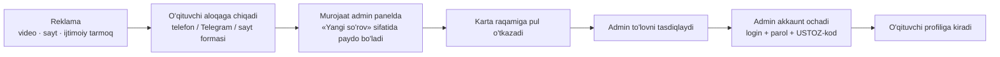
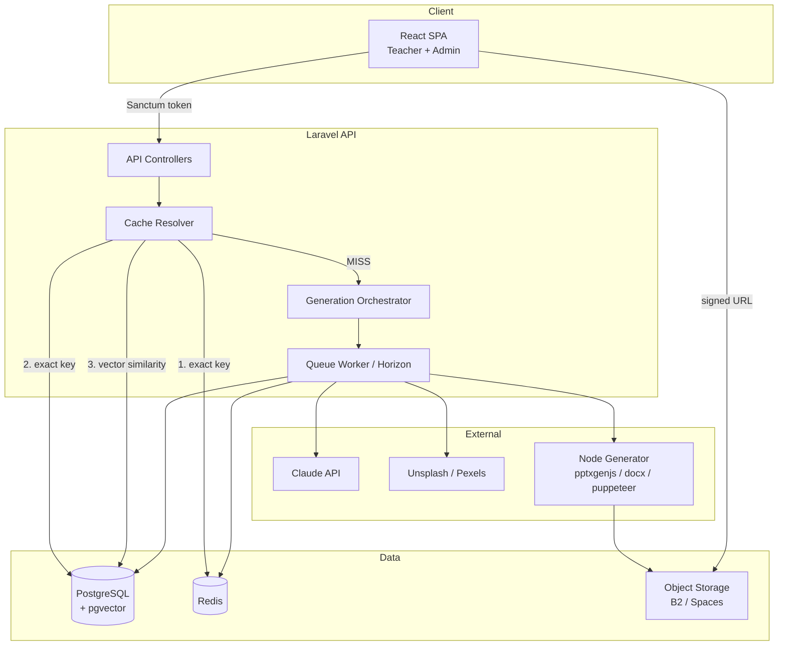
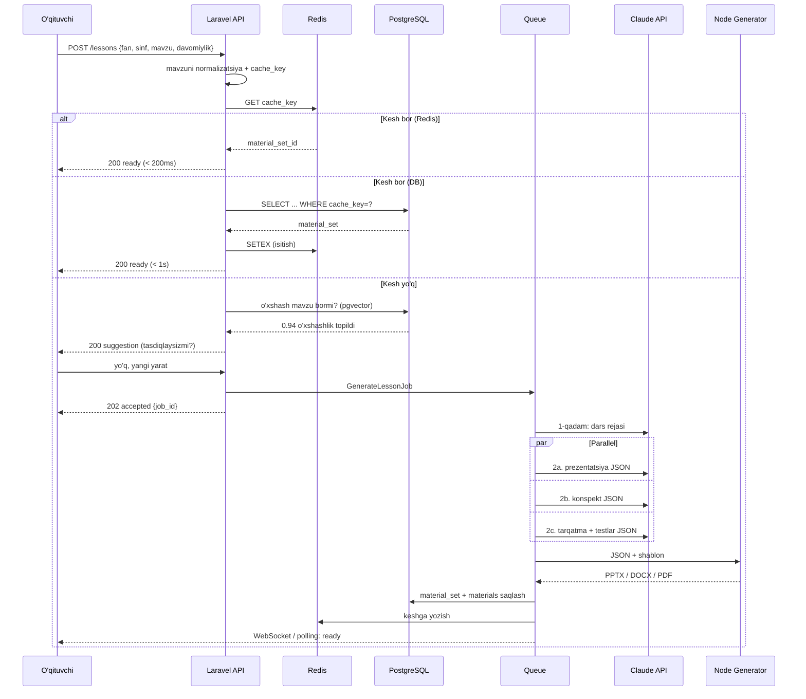

# USTOZ AI — Umumiy arxitektura

> AI yordamida barcha fan o'qituvchilari uchun dars materiallari platformasi
> Hujjat sanasi: 2026-07-30 · Versiya: 1.0 (loyihalash bosqichi)

---

## 1. Mahsulot ta'rifi

**Muammo.** O'qituvchi bitta darsga tayyorgarlik uchun 2–4 soat sarflaydi: prezentatsiya, konspekt, tarqatma, test — hammasi qo'lda.

**Yechim.** O'qituvchi 4 ta narsani tanlaydi (fan, sinf, mavzu, davomiylik) — 2 daqiqada 6 xil tayyor material oladi.

### Yaratiladigan materiallar va formatlar

| # | Material | Format | Hajm |
|---|---|---|---|
| 1 | Prezentatsiya | **PPTX** | 15 slayd |
| 2 | O'qituvchi konspekti | **DOCX** | to'liq dars ishlanmasi |
| 3 | Tarqatma material | **PDF** | kartochka, mashq, guruh ishi |
| 4 | Oddiy test | **PDF** | 20 ta savol (A/B/C/D) + javoblar varag'i |
| 5 | Chorak baholash testi | **PDF** | 30 ta savol, 3 daraja + javoblar varag'i |
| 6 | Qo'shimcha materiallar | **PDF** | crossword, matching, warm-up, exit ticket… |

**Barcha 6 fayl bitta ZIP arxivda ham yuklab olinadi.**

Testlar va qo'shimchalar **PDF** — chunki ular bevosita chop etish uchun. Javoblar har doim **alohida sahifada** (o'quvchiga tarqatiladigan qism va o'qituvchi qismi ajratilgan).

> 💡 Kelajakda testlar uchun **DOCX** varianti ham qo'shilishi mumkin (o'qituvchi savollarni o'zgartirmoqchi bo'lsa). Node generatorda bu ~1 kunlik ish — ammo MVP'da kerak emas, chunki tahrirlash dastur ichida qilinadi.

**Biznes modeli.** Oylik obuna. Asosiy iqtisodiy ustunlik — **kesh**: bir marta yaratilgan material minglab o'qituvchiga qayta xizmat qiladi, AI xarajati esa nolga intiladi.

### Sotuv va to'lov modeli

**To'lov shlyuzi (Payme / Click / Uzum) ishlatilmaydi.** Sotuv qo'lda, aloqa orqali:



**Nima uchun bu to'g'ri qaror:**

| Afzallik | Izoh |
|---|---|
| Integratsiya vaqti nol | Payme/Click ulanish 2–4 hafta + shartnoma + komissiya |
| Komissiya yo'q | To'lov tizimlari 1.5–3% oladi |
| To'liq nazorat | Kim, qachon, qancha to'laganini admin biladi |
| Ishonch | O'zbekistonda "gaplashib, karta orqali" — odatiy va ishonchli |
| Moslashuvchan | Chegirma, sinov muddati, maktabga to'plam — hammasi qo'lda |

**Kamchiligi:** 500+ foydalanuvchidan keyin qo'lda ishlash og'irlashadi. O'sha paytda Payme/Click qo'shiladi — arxitektura bunga tayyor (`payments.method` enum'iga yangi qiymat qo'shiladi, qolgani o'zgarmaydi).

**Tizim nimani qo'llab-quvvatlashi kerak:**
1. Saytdagi **"Buyurtma berish"** formasi → `leads` jadvaliga tushadi
2. Admin panelda **murojaatlar ro'yxati** (yangi / bog'lanildi / to'ladi / rad etdi)
3. Bitta tugmada: **to'lovni qayd etish → akkaunt ochish → faollashtirish**
4. Yaratilgan login/parol **SMS yoki Telegram** orqali yuboriladi

### Muvaffaqiyat mezonlari (MVP)

| Ko'rsatkich | Maqsad |
|---|---|
| Generatsiya vaqti (kesh yo'q) | < 90 soniya |
| Generatsiya vaqti (kesh bor) | < 3 soniya |
| Kesh hit rate (6 oydan keyin) | > 70% |
| Bir generatsiya AI xarajati | < $0.50 |
| Material sifati (o'qituvchi bahosi) | > 4.0 / 5 |

---

## 2. Texnologiya steki

Hujjatda Next.js + NestJS taklif qilingan edi. **Laravel + React tanlandi** — sabab: mavjud tajriba, OSPanel muhiti, ancha tezroq natija. Sifat yo'qotilmaydi.

### Backend — Laravel 12 (PHP 8.3)

| Komponent | Tanlov | Sabab |
|---|---|---|
| Framework | Laravel 12 | Mavjud tajriba, tayyor auth/queue/cache |
| Auth | Sanctum (SPA token) | React bilan eng sodda integratsiya |
| Queue | Redis + Horizon | Generatsiya fon rejimida ishlaydi |
| Rollar | spatie/laravel-permission | super_admin / admin / teacher |
| Audit | spatie/laravel-activitylog | Hujjatdagi "Audit Log" talabi |

### Frontend — React 19 + Vite

| Komponent | Tanlov |
|---|---|
| Build | Vite 5 |
| Routing | React Router 7 |
| Stil | Tailwind CSS 4 |
| Animatsiya | Framer Motion |
| Server state | TanStack Query |
| Forma | React Hook Form + Zod |
| Ikonka | Lucide React |

### Ma'lumotlar bazasi — PostgreSQL 16 + pgvector

> ⚠️ **Diqqat:** OSPanel odatda MySQL bilan keladi. PostgreSQL'ni alohida o'rnatish kerak.
> `pgvector` kengaytmasi mavzular o'xshashligini topish uchun zarur — MySQL'da bunday imkoniyat yo'q.
> Ikkita bazani aralashtirmang: **dev ham, prod ham PostgreSQL** bo'lsin.

### Kesh va navbat — Redis 7

- Kesh qatlami (issiq materiallar, TTL 30 kun)
- Queue driver
- Rate limiting
- Session

### Fayl generatsiyasi — Node sidecar xizmati

**Bu eng muhim arxitektura qarori.**

PHP'ning `phpoffice/phppresentation` kutubxonasi PPTX yarata oladi, lekin "dunyo darajasidagi dizayn" uchun kuchsiz. Shuning uchun alohida **Node mikroxizmati** ishlatiladi:

```
Laravel (Job)  ──HTTP──>  Node generator (localhost:4000)  ──>  fayl
```

| Format | Kutubxona | Nima uchun |
|---|---|---|
| PPTX | `pptxgenjs` | Eng yaxshi dizayn nazorati, shablon qo'llab-quvvatlash |
| DOCX | `docx` (npm) | To'liq stil, jadval, sarlavha nazorati |
| PDF | Puppeteer (HTML → PDF) | HTML/CSS bilan istalgan dizayn |

Node xizmati **stateless** — faqat JSON qabul qiladi, fayl qaytaradi.

### Fayl saqlash

| Bosqich | Yechim |
|---|---|
| MVP / lokal | `storage/app/public` (Laravel disk) |
| Production | S3-mos: Backblaze B2 yoki DigitalOcean Spaces |

> AWS S3 emas — B2 va Spaces 4–5 barobar arzon, API bir xil (`league/flysystem-aws-s3-v3` ishlaydi).

### AI provayderlar

Asosiy: **Claude API** (Sonnet — narx/sifat muvozanati eng yaxshi).
Arxitektura provayderni almashtirishga tayyor bo'ladi (`AiProvider` interfeysi) — Claude, OpenAI, Gemini.

---

## 3. Tizim arxitekturasi



### Generatsiya oqimi (asosiy stsenariy)



---

## 4. Papka tuzilishi (production darajasida)

```
ustoz.loc/
├── app/
│   ├── Console/Commands/
│   │   ├── CacheWarmup.php            # ommabop mavzularni oldindan yaratish
│   │   ├── GenerateVariants.php       # mashhur mavzularga 2-3 variant
│   │   └── SubscriptionExpire.php     # muddati tugaganlarni yopish
│   ├── Http/
│   │   ├── Controllers/Api/
│   │   │   ├── Auth/                  # login, activation, refresh
│   │   │   ├── Teacher/               # lesson, material, editor, profile
│   │   │   └── Admin/                 # users, codes, payments, stats, cache
│   │   ├── Middleware/
│   │   │   ├── EnsureSubscriptionActive.php
│   │   │   └── CheckGenerationQuota.php
│   │   ├── Requests/
│   │   └── Resources/                 # API JSON resurslari
│   ├── Jobs/
│   │   ├── GenerateLessonJob.php      # orkestrator
│   │   ├── GenerateSectionJob.php     # prezentatsiya / konspekt / test
│   │   ├── RenderFileJob.php          # Node xizmatiga yuborish
│   │   └── EmbedTopicJob.php          # vektor hisoblash
│   ├── Models/
│   ├── Policies/
│   ├── Services/
│   │   ├── Ai/
│   │   │   ├── Contracts/AiProvider.php
│   │   │   ├── ClaudeProvider.php
│   │   │   ├── OpenAiProvider.php
│   │   │   ├── GeminiProvider.php
│   │   │   ├── AiManager.php          # provayder tanlash + fallback
│   │   │   └── Prompts/               # har material turi uchun prompt
│   │   ├── Cache/
│   │   │   ├── TopicNormalizer.php    # kirill↔lotin, stop-so'z, tinish
│   │   │   ├── CacheKeyBuilder.php
│   │   │   ├── CacheResolver.php      # 3 bosqichli qidiruv
│   │   │   └── SimilarityFinder.php   # pgvector
│   │   ├── Generation/
│   │   │   ├── LessonOrchestrator.php
│   │   │   ├── Steps/                 # PlanStep, SlidesStep, TestsStep...
│   │   │   └── AssetResolver.php      # rasm + ikonka topish
│   │   ├── Rendering/
│   │   │   └── GeneratorClient.php    # Node xizmati HTTP klienti
│   │   ├── Subscription/
│   │   │   ├── ActivationService.php
│   │   │   └── QuotaService.php
│   │   └── Editor/
│   │       └── OverlayService.php     # tahrirni kesh ustiga qo'yish
│   └── Support/
├── config/
│   ├── ai.php                         # provayder, model, narx, limit
│   ├── generation.php                 # bosqichlar, timeout, retry
│   └── ustoz.php                      # fan, sinf, til ro'yxati
├── database/
│   ├── migrations/
│   ├── seeders/                       # fanlar, sinflar, tariflar
│   └── factories/
├── routes/
│   ├── api.php
│   └── channels.php                   # broadcast (generatsiya progressi)
│
├── frontend/                          # React SPA
│   ├── src/
│   │   ├── api/                       # axios klient + endpointlar
│   │   ├── components/
│   │   │   ├── ui/                    # Button, Card, Modal, Input...
│   │   │   ├── lesson/                # wizard, progress, material card
│   │   │   └── editor/
│   │   ├── pages/
│   │   │   ├── auth/
│   │   │   ├── teacher/
│   │   │   └── admin/
│   │   ├── hooks/
│   │   ├── lib/
│   │   └── styles/
│   ├── tailwind.config.js
│   └── vite.config.js
│
├── generator/                         # Node sidecar
│   ├── src/
│   │   ├── server.js                  # Express
│   │   ├── pptx/
│   │   │   ├── build.js
│   │   │   ├── layouts/               # 12 ta slayd maketi
│   │   │   └── themes/                # fan bo'yicha rang/shrift
│   │   ├── docx/build.js
│   │   ├── pdf/
│   │   │   ├── build.js
│   │   │   └── templates/             # HTML shablonlar
│   │   └── assets/                    # ikonka, fon, naqsh
│   └── package.json
│
├── docs/                              # shu hujjatlar
├── storage/
└── tests/
```

---

## 5. Xavfsizlik arxitekturasi

| Talab | Amalga oshirish |
|---|---|
| Parol shifrlash | Laravel `bcrypt` (rounds=12) |
| Autentifikatsiya | Sanctum token, TTL 7 kun, refresh |
| Rollar | `spatie/laravel-permission` + Policy har model uchun |
| SQL Injection | Eloquent / query builder — xom SQL taqiqlanadi |
| XSS | React avtomatik escape + `dangerouslySetInnerHTML` taqiqi |
| CSRF | SPA token rejimi (cookie emas) — CSRF vektor yo'q |
| Rate limiting | `throttle:api` 60/min; generatsiya 10/soat/user |
| Audit log | `spatie/laravel-activitylog` — barcha admin amali |
| Backup | Kunlik `pg_dump` + fayl storage sync, 30 kun saqlash |
| Fayl yuklab olish | Imzolangan vaqtinchalik URL (15 daqiqa) |
| Sirlar | `.env` — repoga hech qachon tushmaydi; prod'da env-var |
| Ma'lumot | Parol/token loglarga yozilmaydi (log scrubbing) |

### Alohida diqqat: AI prompt injection

O'qituvchi kiritgan "mavzu" matni to'g'ridan-to'g'ri promptga tushadi. Himoya:

1. Uzunlik limiti (200 belgi)
2. Faqat harf/raqam/tinish belgilariga ruxsat
3. Prompt ichida aniq chegara: `<user_topic>...</user_topic>`
4. Chiqish JSON sxemasi bilan validatsiya — sxemaga mos kelmasa rad etiladi

---

## 6. Cloud infratuzilmasi

### MVP (0–500 o'qituvchi) — ~$40–60/oy

| Xizmat | Konfiguratsiya | Narx |
|---|---|---|
| VPS (Hetzner CPX21) | 3 vCPU, 4 GB RAM | ~€8/oy |
| PostgreSQL | shu VPS'da (Docker) | — |
| Redis | shu VPS'da | — |
| Storage (Backblaze B2) | ~100 GB | ~$0.6/oy |
| Domen + SSL | Let's Encrypt | ~$15/yil |
| AI (Claude) | o'zgaruvchan | $30–50/oy |

### O'sish (500–5000) — ~$200–350/oy

- Ilova VPS (CPX41) + alohida DB serveri (managed PostgreSQL)
- Redis alohida
- CDN (Cloudflare — bepul reja yetadi)
- Queue worker'lar alohida jarayonda (Horizon, 4 worker)

### Deploy

```
GitHub → GitHub Actions → SSH deploy → VPS
  ├── composer install --no-dev -o
  ├── php artisan migrate --force
  ├── npm run build (frontend)
  ├── pm2 restart generator
  └── php artisan horizon:terminate
```

Docker Compose bilan: `app` (php-fpm), `nginx`, `postgres`, `redis`, `horizon`, `generator`.

---

## 7. Mobil ilova rejasi

**MVP — PWA emas, Mobile-First SPA.** Telefonda brauzerdan mukammal ishlaydi, "Bosh ekranga qo'shish" mumkin.

**Keyingi bosqich — Capacitor** (React Native emas):

| Yondashuv | Vaqt | Sabab |
|---|---|---|
| ✅ Capacitor | 2–3 hafta | Mavjud React kodi 95% qayta ishlatiladi |
| ❌ React Native | 3–4 oy | Butun UI qaytadan yoziladi |

Capacitor beradi: Play Store / App Store'da joylash, push-bildirishnoma, fayl tizimiga to'g'ridan-to'g'ri yuklab olish, offline kesh.

> Shart: frontend'ni boshidanoq **API-only** qilib yozish (Blade template ishlatmaslik) — Capacitor keyin muammosiz ishlaydi.

---

## 8. Bosqichma-bosqich ishlab chiqish rejasi

| Faza | Muddat | Natija |
|---|---|---|
| **0. Poydevor** | 1–2 hafta | Laravel + React skeleti, PostgreSQL, Redis, auth, rollar, migratsiyalar |
| **1. Yadro oqimi** | 3–4 hafta | Bitta fan (rus tili 5–9). Wizard → AI → PPTX + DOCX. Node generator + 2 shablon |
| **2. Kesh + to'liq to'plam** | 2–3 hafta | 3 bosqichli kesh, pgvector, PDF tarqatma, 20+30 test, qo'shimcha materiallar |
| **3. Biznes qatlami** | 2–3 hafta | Obuna, activation code, admin panel, murojaatlar (leads), qo'lda to'lov qayd etish, statistika |
| **4. Tahrirlash** | 3–4 hafta | Matn darajasidagi editor + "qismni qayta yarat" + overlay tizimi |
| **5. Kengaytirish** | 3–4 hafta | Barcha fanlar, 11 sinf, 4 til, mobile polish, shablonlar kutubxonasi |
| **6. Mobil** | 2–3 hafta | Capacitor → Android/iOS |

**Jami MVP (0–3 faza): ~9–12 hafta.** To'liq mahsulot: ~5–6 oy.

### Faza 1'da NIMA QILINMAYDI (ataylab)

Bularsiz ham mahsulot sotiladi. Erta qilish — loyihani cho'ktiradi:

- ❌ WYSIWYG slayd muharriri (brauzerda PowerPoint qurish — 3+ oy)
- ❌ To'lov shlyuzi (Payme/Click/Uzum) — qo'lda karta orqali, 500+ foydalanuvchidan keyin ko'riladi
- ❌ Barcha 15 fan (bitta fanda sifat isbotlansin)
- ❌ AI rasm generatsiyasi (qimmat, sekin, o'quv diagrammalarida sifatsiz)
- ❌ Real-time hamkorlik

---

## 9. Ochiq savollar (qaror kerak)

| # | Savol | Tavsiya |
|---|---|---|
| 1 | Qaysi fandan boshlaymiz? | Rus tili yoki ingliz tili — mavzular standart, kesh tez to'ladi |
| 2 | Interfeys tili? | O'zbek (lotin) asosiy; material tili alohida tanlanadi |
| 3 | Obuna narxi? | Xarajat hisobi: [03-AI-KESH.md](03-AI-KESH-GENERATSIYA.md#xarajat-hisobi) |
| 4 | Rasmlar manbai? | Unsplash API (bepul, 50 so'rov/soat) + ichki ikonka kutubxonasi |
| 5 | Domen? | `.uz` yoki `.com` — brend nomi kerak |

---

## Hujjatlar

| Fayl | Mazmun |
|---|---|
| **01-ARXITEKTURA.md** | Shu hujjat — umumiy ko'rinish, stek, infra, reja |
| [02-BAZA-VA-API.md](02-BAZA-VA-API.md) | ERD, jadvallar, API endpointlari |
| [03-AI-KESH-GENERATSIYA.md](03-AI-KESH-GENERATSIYA.md) | Kesh algoritmi, AI oqimi, fayl generatsiyasi, editor |
| [04-UI-UX.md](04-UI-UX.md) | Dizayn tizimi, barcha ekran maketlari |
