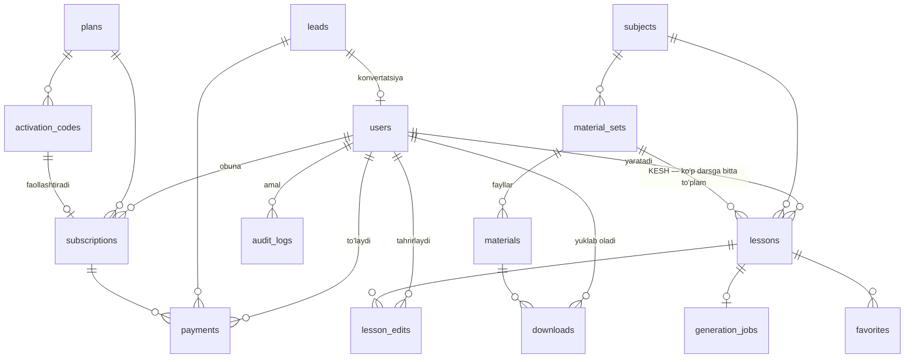
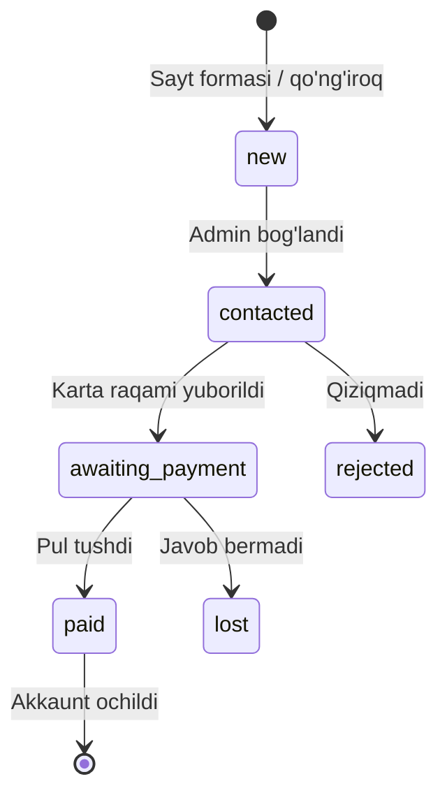
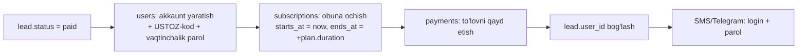

# USTOZ AI — Ma'lumotlar bazasi va API

> [← 01-ARXITEKTURA.md](01-ARXITEKTURA.md)

---

## 1. ERD — umumiy sxema



**Eng muhim bog'lanish:** `lessons → material_sets` = **N:1**.

Ya'ni 500 o'qituvchining "Имя прилагательное, 7-sinf" darsi — bitta `material_set`ga ishora qiladi. Kesh mana shu yerda yashaydi.

---

## 2. Jadvallar

### `users` — foydalanuvchilar

| Ustun | Tur | Izoh |
|---|---|---|
| id | bigint PK | |
| full_name | varchar(150) | |
| phone | varchar(20) UNIQUE | asosiy login |
| email | varchar(150) NULL | ixtiyoriy |
| password | varchar(255) | bcrypt |
| role | enum | `super_admin` / `admin` / `teacher` |
| teacher_code | varchar(12) UNIQUE | ko'rinadigan ID, masalan `USTOZ-4821` |
| status | enum | `pending` / `active` / `suspended` |
| school | varchar(200) NULL | |
| region | varchar(100) NULL | |
| default_subject_id | bigint FK NULL | asosiy fani |
| default_language | varchar(10) | `uz` / `uz_cyrl` / `ru` / `en` |
| must_change_password | boolean | admin bergan vaqtinchalik parol → birinchi kirishda almashtiriladi |
| created_by | bigint FK NULL | qaysi admin ochdi |
| last_login_at | timestamp NULL | |
| created_at, updated_at | timestamp | |

> `phone` login sifatida — O'zbekiston kontekstida email'dan ancha ishonchli.

---

### `plans` — tariflar

| Ustun | Tur | Izoh |
|---|---|---|
| id | bigint PK | |
| slug | varchar(50) UNIQUE | `trial` / `basic` / `pro` |
| name | varchar(100) | |
| price_uzs | integer | |
| duration_days | integer | 7 / 30 / 90 / 365 |
| generation_limit | integer NULL | oyiga; `NULL` = cheksiz |
| features | jsonb | `{editor: true, all_subjects: true}` |
| is_active | boolean | |

**Boshlang'ich tariflar:**

| Tarif | Muddat | Narx | Limit |
|---|---|---|---|
| Sinov | 7 kun | 0 | 3 ta dars |
| Asosiy | 30 kun | 49 000 so'm | 30 ta dars |
| Pro | 30 kun | 89 000 so'm | cheksiz |
| Yillik Pro | 365 kun | 790 000 so'm | cheksiz |

> ⚠️ Narxlar taxminiy — [xarajat hisobi](03-AI-KESH-GENERATSIYA.md#8-xarajat-hisobi) asosida tasdiqlash kerak.

---

### `subscriptions` — obunalar

| Ustun | Tur | Izoh |
|---|---|---|
| id | bigint PK | |
| user_id | bigint FK | |
| plan_id | bigint FK | |
| activation_code_id | bigint FK NULL | qaysi kod bilan ochilgan |
| starts_at | timestamp | |
| ends_at | timestamp | |
| status | enum | `active` / `expired` / `suspended` |
| generations_used | integer | joriy davrdagi sarf |
| activated_by | bigint FK NULL | qaysi admin faollashtirdi |
| created_at, updated_at | | |

**Indeks:** `(user_id, status)`, `(ends_at)` — muddati tugaganlarni topish uchun.

---

### `activation_codes` — faollashtirish kodlari

| Ustun | Tur | Izoh |
|---|---|---|
| id | bigint PK | |
| code | varchar(20) UNIQUE | `UZ-7K3M-9PQX` |
| plan_id | bigint FK | |
| status | enum | `unused` / `used` / `revoked` |
| used_by_user_id | bigint FK NULL | |
| used_at | timestamp NULL | |
| expires_at | timestamp NULL | kod amal qilish muddati |
| created_by | bigint FK | |
| batch_id | uuid NULL | to'plam bo'lib yaratilganda |
| note | varchar(255) NULL | |

---

### `payments` — to'lovlar

| Ustun | Tur | Izoh |
|---|---|---|
| id | bigint PK | |
| user_id | bigint FK | |
| subscription_id | bigint FK NULL | |
| lead_id | bigint FK NULL | qaysi murojaatdan kelgan |
| amount_uzs | integer | |
| method | enum | `card_transfer` / `cash` / `bank` (kelajakda: `payme`, `click`, `uzum`) |
| card_last4 | varchar(4) NULL | tekshirish uchun, to'liq raqam **saqlanmaydi** |
| sender_name | varchar(150) NULL | kim yubordi (chekda ko'rinadi) |
| status | enum | `pending` / `paid` / `refunded` |
| paid_at | timestamp NULL | |
| received_by | bigint FK | qaysi admin tasdiqladi |
| receipt_path | varchar(300) NULL | chek skrinshoti (o'qituvchi yuborsa) |
| note | text NULL | |

> **To'lov shlyuzi yo'q.** O'qituvchi karta raqamiga pul o'tkazadi, admin tasdiqlaydi.
> `external_id` maydoni olib tashlandi — u faqat avtomatik to'lov tizimlari uchun kerak edi.
> Payme/Click qo'shilganda: `method` enum'iga qiymat + `external_id` ustuni qaytariladi. Qolgan sxema o'zgarmaydi.

---

### `leads` — murojaatlar (sotuv voronkasi)

Reklama orqali kelgan har bir so'rov shu yerda. **Bitta ham mijoz yo'qolmasligi kerak.**

| Ustun | Tur | Izoh |
|---|---|---|
| id | bigint PK | |
| full_name | varchar(150) | |
| phone | varchar(20) | |
| telegram | varchar(60) NULL | |
| school | varchar(200) NULL | |
| region | varchar(100) NULL | |
| subject_id | bigint FK NULL | qaysi fandan qiziqmoqda |
| source | enum | `website` / `video` / `telegram` / `instagram` / `referral` / `phone` |
| plan_interest | varchar(50) NULL | qaysi tarif |
| status | enum | `new` / `contacted` / `awaiting_payment` / `paid` / `rejected` / `lost` |
| user_id | bigint FK NULL | akkaunt ochilgach bog'lanadi |
| assigned_to | bigint FK NULL | qaysi admin ishlayapti |
| note | text NULL | suhbat qaydlari |
| contacted_at | timestamp NULL | |
| created_at, updated_at | | |

**Indeks:** `(status, created_at)`, `(phone)`

**Voronka:**



> `status = paid` bo'lganda admin bitta tugma bosadi: **akkaunt yaratiladi + obuna ochiladi + login/parol SMS orqali yuboriladi**. Uchta amal — bitta tranzaksiyada.

---

### `subjects` — fanlar

| Ustun | Tur | Izoh |
|---|---|---|
| id | bigint PK | |
| slug | varchar(50) UNIQUE | `rus_tili`, `matematika` |
| name_uz, name_ru, name_en | varchar(100) | |
| icon | varchar(50) | Lucide ikonka nomi |
| color | varchar(7) | `#4F46E5` |
| theme_key | varchar(50) | PPTX shablon mavzusi |
| grade_min, grade_max | smallint | masalan 5–11 |
| default_language | varchar(10) | rus tili → `ru` |
| is_active | boolean | |
| sort_order | smallint | |

**Fanlar ro'yxati (seeder):** ona tili, rus tili, ingliz tili, matematika, algebra, geometriya, fizika, kimyo, biologiya, tarix, geografiya, informatika, tarbiya, chizmachilik, musiqa, tasviriy san'at, jismoniy tarbiya.

---

### `material_sets` — 🔑 KESH YADROSI

Bu jadval butun tizimning yuragi.

| Ustun | Tur | Izoh |
|---|---|---|
| id | bigint PK | |
| cache_key | char(64) | `sha256(subject\|grade\|topic_norm\|duration\|lang\|variant)` |
| subject_id | bigint FK | |
| grade | smallint | |
| topic_raw | varchar(200) | birinchi o'qituvchi yozgani |
| topic_normalized | varchar(200) | normalizatsiyadan keyin |
| topic_display | varchar(200) | AI tuzatgan chiroyli sarlavha |
| duration | smallint | 45 / 80 |
| language | varchar(10) | |
| variant | smallint | 1 / 2 / 3 — bir mavzuga bir necha versiya |
| content | jsonb | **barcha generatsiya qilingan kontent** |
| topic_embedding | vector(1536) | pgvector — o'xshashlik qidiruvi |
| status | enum | `ready` / `failed` / `archived` |
| hit_count | integer | necha marta qayta ishlatilgan |
| rating_sum, rating_count | integer | o'qituvchilar bahosi |
| ai_provider | varchar(30) | `claude` |
| ai_model | varchar(60) | `claude-sonnet-5` |
| input_tokens, output_tokens | integer | |
| cost_usd | decimal(10,5) | |
| generation_ms | integer | |
| created_at, updated_at | | |

**Indekslar:**
```sql
CREATE UNIQUE INDEX ON material_sets (cache_key);
CREATE INDEX ON material_sets (subject_id, grade, duration, language);
CREATE INDEX ON material_sets USING hnsw (topic_embedding vector_cosine_ops);
CREATE INDEX ON material_sets (hit_count DESC);   -- eng mashhur mavzular
```

**`content` jsonb tuzilishi:**

```jsonc
{
  "plan": {
    "objectives": ["..."],          // dars maqsadi
    "outcomes": ["..."],            // kutilayotgan natija
    "competencies": ["..."],        // kompetensiyalar
    "key_terms": [{"term": "...", "definition": "..."}],
    "misconceptions": ["..."],      // o'quvchilar tez-tez xato qiladigan joylar
    "timeline": [{"min": 5, "stage": "Kirish", "activity": "..."}]
  },
  "presentation": {
    "theme": "language_arts",
    "slides": [
      {
        "n": 1,
        "layout": "title",          // 12 maketdan biri
        "title": "...",
        "subtitle": "...",
        "image_query": "russian grammar classroom",
        "notes": "O'qituvchi uchun izoh"
      },
      {
        "n": 4,
        "layout": "table",
        "title": "...",
        "table": {"headers": ["..."], "rows": [["..."]]}
      }
    ]
  },
  "konspekt": {
    "intro": "...",
    "teacher_script": [{"stage": "...", "speech": "...", "duration_min": 5}],
    "questions": [{"q": "...", "expected": "..."}],
    "methods": ["Klaster", "Insert", "Venn diagrammasi"],
    "consolidation": "...",
    "assessment": {"criteria": [...], "rubric": [...]},
    "reflection": "...",
    "homework": "..."
  },
  "handout": {
    "cards": [...],
    "exercises": [...],
    "pair_work": [...],
    "group_work": [...],
    "individual_work": [...],
    "cut_outs": [...]
  },
  "test_simple":  { "questions": [{"q":"...","options":{"A":"..","B":"..","C":"..","D":".."},"answer":"B"}] },
  "test_quarter": { "questions": [{"q":"...","options":{...},"answer":"C","difficulty":"hard"}] },
  "extras": {
    "crossword":   {"grid": [...], "clues": {...}},
    "word_search": {...},
    "matching":    [{"left":"...","right":"..."}],
    "true_false":  [...],
    "fill_blanks": [...],
    "speaking":    {...},
    "writing":     {...},
    "critical_thinking": {...},
    "warm_up":     "...",
    "icebreaker":  "...",
    "exit_ticket": "...",
    "reflection":  "..."
  },
  "meta": { "generated_at": "...", "schema_version": 1 }
}
```

---

### `materials` — generatsiya qilingan fayllar

| Ustun | Tur | Izoh |
|---|---|---|
| id | bigint PK | |
| material_set_id | bigint FK | |
| type | enum | `pptx` / `docx` / `pdf_handout` / `pdf_test_simple` / `pdf_test_quarter` / `pdf_extras` |
| disk | varchar(30) | `public` / `b2` |
| path | varchar(300) | |
| file_size | integer | bayt |
| checksum | char(64) | sha256 |
| template_key | varchar(60) | qaysi shablon bilan qurilgan |
| render_ms | integer | |
| created_at | | |

---

### `lessons` — o'qituvchining darslari

| Ustun | Tur | Izoh |
|---|---|---|
| id | bigint PK | |
| user_id | bigint FK | |
| material_set_id | bigint FK NULL | tayyor bo'lgach to'ldiriladi |
| subject_id | bigint FK | |
| grade | smallint | |
| topic_raw | varchar(200) | o'qituvchi yozgani (o'zgarmaydi) |
| duration | smallint | |
| language | varchar(10) | |
| title | varchar(200) NULL | o'qituvchi qo'ygan nom |
| status | enum | `queued` / `generating` / `ready` / `failed` |
| was_cache_hit | boolean | analitika uchun |
| planned_date | date NULL | qachon o'tiladi |
| created_at, updated_at | | |

---

### `lesson_edits` — tahrirlar (overlay)

> **Kritik dizayn qarori.** O'qituvchi tahriri `material_sets`ga **yozilmaydi**.
> Aks holda bir o'qituvchining o'zgartirishi keshni ishlatayotgan minglab boshqasiga tarqaladi.
> Tahrir alohida saqlanadi va ko'rsatishda kesh ustiga qo'yiladi.

| Ustun | Tur | Izoh |
|---|---|---|
| id | bigint PK | |
| lesson_id | bigint FK | |
| user_id | bigint FK | |
| overrides | jsonb | faqat **o'zgargan** yo'llar |
| version | integer | tahrir tarixi |
| created_at, updated_at | | |

**`overrides` misoli** — JSON Pointer uslubida:

```jsonc
{
  "presentation.slides.3.title": "Yangi sarlavha",
  "presentation.slides.7":       null,              // slaydni o'chirish
  "presentation.slides._insert": [{"after": 5, "slide": {...}}],
  "test_simple.questions.12.q":  "Qayta yozilgan savol",
  "konspekt.homework":           "Boshqa uy vazifasi"
}
```

Ko'rsatishda: `render(deepMerge(material_set.content, lesson_edit.overrides))`

---

### `generation_jobs` — generatsiya holati

| Ustun | Tur | Izoh |
|---|---|---|
| id | bigint PK | |
| lesson_id | bigint FK | |
| status | enum | `queued` / `running` / `done` / `failed` |
| progress | smallint | 0–100 |
| current_step | varchar(60) | `plan` / `slides` / `tests` / `render_pptx` |
| attempts | smallint | |
| error_message | text NULL | |
| started_at, finished_at | timestamp NULL | |

---

### `ai_usage_logs` — AI sarfi

| Ustun | Tur |
|---|---|
| id, user_id, lesson_id, material_set_id | |
| provider, model | varchar |
| step | varchar(40) |
| input_tokens, output_tokens, cached_tokens | integer |
| cost_usd | decimal(10,6) |
| latency_ms | integer |
| cache_hit | boolean |
| created_at | timestamp |

**Indeks:** `(created_at)`, `(user_id, created_at)` — kunlik/oylik hisobot uchun.

---

### Qolgan jadvallar

| Jadval | Ustunlar |
|---|---|
| `favorites` | user_id, lesson_id, created_at |
| `downloads` | user_id, material_id, ip, created_at |
| `ratings` | user_id, material_set_id, stars (1–5), comment, created_at |
| `announcements` | title, body, type(`news`/`banner`/`alert`), target, starts_at, ends_at, is_active |
| `announcement_reads` | user_id, announcement_id, read_at |
| `audit_logs` | user_id, action, subject_type, subject_id, ip, user_agent, meta jsonb, created_at |
| `settings` | key, value jsonb — tizim sozlamalari (AI model, limitlar) |

---

## 3. API arxitekturasi

**Uslub:** REST + JSON. Barcha javob `data` / `meta` / `errors` konvertida.
**Auth:** `Authorization: Bearer <sanctum-token>`
**Versiya:** `/api/v1/...`

### 3.0 Ochiq endpointlar (auth talab qilinmaydi)

| Metod | Endpoint | Izoh |
|---|---|---|
| POST | `/public/leads` | Saytdagi "Buyurtma berish" formasi |
| GET | `/public/plans` | Tariflar va narxlar (landing sahifa uchun) |
| GET | `/public/stats` | «412 o'qituvchi · 1 240 dars» — ijtimoiy dalil |

**`POST /public/leads`:**

```jsonc
// So'rov
{ "full_name": "Sherzod Sirojidinov",
  "phone": "+998901234567",
  "telegram": "@sherzod",
  "school": "Andijon Yuksalish maktabi",
  "region": "Andijon",
  "subject_id": 2,
  "plan_interest": "pro",
  "source": "video" }

// Javob
{ "data": { "message": "Murojaatingiz qabul qilindi. 1 soat ichida bog'lanamiz.",
             "contact": { "phone": "+998 XX XXX XX XX", "telegram": "@ustoz_ai" } } }
```

> **Himoya:** `throttle:5,60` (IP bo'yicha soatiga 5 ta), telefon raqami formati validatsiyasi, honeypot maydon. CAPTCHA MVP'da kerak emas.
> Yangi murojaat kelganda adminga **Telegram bot** orqali darhol xabar boradi.

### 3.1 Autentifikatsiya

| Metod | Endpoint | Izoh |
|---|---|---|
| POST | `/auth/login` | `{phone, password}` → token |
| POST | `/auth/activate` | `{code}` → obunani ochadi |
| POST | `/auth/refresh` | tokenni yangilash |
| POST | `/auth/logout` | |
| GET | `/auth/me` | joriy user + obuna holati |
| POST | `/auth/password/change` | |
| POST | `/auth/password/first-change` | birinchi kirishda parolni almashtirish (majburiy) |

> Ro'yxatdan o'tish (`register`) **yo'q** — akkauntni faqat admin ochadi. Bu ataylab: to'lov qo'lda qabul qilinadi, shuning uchun akkaunt ham qo'lda ochiladi.
>
> Admin yaratgan parol **vaqtinchalik**. O'qituvchi birinchi kirishda uni almashtirishi majburiy (`users.must_change_password` bayrog'i).

### 3.2 Ma'lumotnomalar

| Metod | Endpoint |
|---|---|
| GET | `/catalog/subjects` |
| GET | `/catalog/subjects/{id}/grades` |
| GET | `/catalog/languages` |
| GET | `/catalog/popular-topics?subject_id=&grade=` |

`popular-topics` — `hit_count DESC` bo'yicha; o'qituvchiga taklif sifatida ko'rsatiladi (bu kesh hit rate'ni oshiradi).

### 3.3 Darslar va generatsiya

| Metod | Endpoint | Izoh |
|---|---|---|
| POST | `/lessons/preflight` | keshni tekshiradi, AI'ni **chaqirmaydi** |
| POST | `/lessons` | dars yaratish; kesh bo'lsa `200 ready`, bo'lmasa `202` |
| GET | `/lessons` | ro'yxat: filtr, qidiruv, sahifalash |
| GET | `/lessons/{id}` | to'liq kontent (tahrir overlay bilan) |
| GET | `/lessons/{id}/status` | generatsiya progressi (polling zaxira) |
| PATCH | `/lessons/{id}` | nom, sana o'zgartirish |
| DELETE | `/lessons/{id}` | |
| POST | `/lessons/{id}/favorite` | |
| POST | `/lessons/{id}/rate` | `{stars, comment}` |
| POST | `/lessons/{id}/regenerate` | `{section: "presentation"}` — faqat bir qismni |
| POST | `/lessons/{id}/variant` | boshqa variantni so'rash |

**`POST /lessons/preflight` javobi:**

```jsonc
{
  "data": {
    "cache_status": "similar",        // "exact" | "similar" | "miss"
    "estimated_seconds": 2,
    "similar": [
      { "material_set_id": 812,
        "topic_display": "Имя прилагательное",
        "similarity": 0.94,
        "rating": 4.6,
        "used_by_teachers": 137 }
    ],
    "quota": { "used": 12, "limit": 30, "remaining": 18 }
  }
}
```

**`POST /lessons` javobi (kesh yo'q):**

```jsonc
{ "data": { "lesson_id": 4412, "status": "queued", "job_id": "...",
             "estimated_seconds": 75, "channel": "lesson.4412" } }
```

Progress **WebSocket** orqali (Laravel Reverb, `lesson.{id}` kanali). Polling — zaxira variant.

### 3.4 Materiallar

| Metod | Endpoint | Izoh |
|---|---|---|
| GET | `/lessons/{id}/materials` | ro'yxat + hajm |
| GET | `/materials/{id}/preview` | JSON preview (brauzerda ko'rish) |
| GET | `/materials/{id}/download` | 302 → imzolangan URL (15 daq) |
| POST | `/lessons/{id}/download-all` | ZIP tayyorlaydi |

### 3.5 Tahrirlash

| Metod | Endpoint | Izoh |
|---|---|---|
| GET | `/lessons/{id}/edits` | joriy overlay |
| PUT | `/lessons/{id}/edits` | overlay saqlash |
| DELETE | `/lessons/{id}/edits` | asl holatga qaytarish |
| POST | `/lessons/{id}/rebuild` | tahrirdan keyin fayllarni qayta qurish |
| POST | `/lessons/{id}/assets` | o'z rasmini yuklash |

### 3.6 Profil va obuna

| Metod | Endpoint |
|---|---|
| GET / PATCH | `/profile` |
| GET | `/subscription` |
| GET | `/subscription/history` |
| GET | `/payments` |
| GET | `/downloads` |
| GET | `/announcements` |

### 3.7 Admin (`/admin/...`, `role:admin|super_admin`)

| Metod | Endpoint | Izoh |
|---|---|---|
| GET | `/admin/stats` | dashboard: user, daromad, AI xarajat, kesh hit rate, yangi murojaatlar |
| GET | `/admin/leads` | murojaatlar ro'yxati, status filtri |
| GET | `/admin/leads/{id}` | |
| PATCH | `/admin/leads/{id}` | status, izoh, mas'ul admin |
| POST | `/admin/leads/{id}/convert` | **🔑 bitta tugma — pastga qarang** |
| POST | `/admin/leads` | qo'ng'iroq orqali kelgan murojaatni qo'lda kiritish |
| GET | `/admin/teachers` | qidiruv, filtr |
| POST | `/admin/teachers` | yangi akkaunt ochish |
| GET | `/admin/teachers/{id}` | |
| PATCH | `/admin/teachers/{id}` | |
| POST | `/admin/teachers/{id}/activate` | **1 tugma — telefondan** |
| POST | `/admin/teachers/{id}/suspend` | |
| POST | `/admin/teachers/{id}/extend` | `{days}` |
| POST | `/admin/teachers/{id}/reset-password` | |
| GET / POST | `/admin/codes` | kodlar ro'yxati / to'plam yaratish |
| POST | `/admin/codes/{id}/revoke` | |
| GET | `/admin/codes/export` | CSV |
| GET / POST | `/admin/payments` | to'lovlar / qo'lda qayd etish |
| GET | `/admin/ai-usage` | kunlik/oylik sarf grafigi |
| GET | `/admin/cache` | material_sets ro'yxati, reyting bo'yicha saralash |
| GET | `/admin/cache/{id}` | kontentni ko'rish |
| DELETE | `/admin/cache/{id}` | sifatsiz materialni o'chirish |
| POST | `/admin/cache/warmup` | ommabop mavzularni oldindan yaratish |
| GET / POST | `/admin/announcements` | |
| POST | `/admin/broadcast` | barchaga xabar |
| GET | `/admin/audit-logs` | |

### 3.8 🔑 `POST /admin/leads/{id}/convert` — bitta tugmali sotuv

Bu tizimning eng ko'p ishlatiladigan admin amali. Telefondan, 10 soniyada.

```jsonc
// So'rov
{ "plan_id": 3,
  "amount_uzs": 99000,
  "method": "card_transfer",
  "card_last4": "4821",
  "sender_name": "SIROJIDINOV SH",
  "paid_at": "2026-07-30T14:22:00+05:00",
  "send_credentials": true }        // SMS/Telegram orqali yuborish
```

Bitta DB tranzaksiyasida **beshta amal**:



```jsonc
// Javob
{ "data": {
    "user":  { "id": 413, "teacher_code": "USTOZ-4821",
               "phone": "+998901234567", "temp_password": "Ustoz7392" },
    "subscription": { "plan": "Pro", "ends_at": "2026-08-30" },
    "payment_id": 187,
    "credentials_sent": true } }
```

> ⚠️ `temp_password` javobda **faqat bir marta** qaytariladi (bazada hash saqlanadi). Admin uni ko'chirib olishi yoki avtomatik yuborilishiga ishonishi mumkin.

**Xatolik holatlari:**

| Kod | HTTP | Sabab |
|---|---|---|
| `LEAD_ALREADY_CONVERTED` | 409 | Bu murojaat bo'yicha akkaunt ochilgan |
| `PHONE_ALREADY_EXISTS` | 409 | Bu telefon bilan akkaunt bor — uzaytirishni taklif qiladi |
| `SMS_FAILED` | 200 | Akkaunt ochildi, lekin SMS ketmadi — parol javobda qaytariladi |

### 3.9 Xatolik formati

```jsonc
{
  "errors": [{
    "code": "SUBSCRIPTION_EXPIRED",
    "message": "Obunangiz muddati tugagan.",
    "detail": "2026-07-15 sanasida tugagan.",
    "action": { "type": "renew", "url": "/subscription" }
  }]
}
```

**Asosiy xato kodlari:**

| Kod | HTTP | Izoh |
|---|---|---|
| `SUBSCRIPTION_EXPIRED` | 402 | Obuna tugagan |
| `SUBSCRIPTION_SUSPENDED` | 403 | Admin to'xtatgan |
| `QUOTA_EXCEEDED` | 429 | Oylik limit tugagan |
| `GENERATION_FAILED` | 500 | AI xatosi (avtomatik retry: 2 marta) |
| `INVALID_TOPIC` | 422 | Mavzu validatsiyadan o'tmadi |
| `CODE_ALREADY_USED` | 409 | Activation code ishlatilgan |

---

## 4. Middleware zanjiri

```
api
 └── throttle:60,1
     └── auth:sanctum
         └── EnsureUserActive          (status = active)
             └── EnsureSubscriptionActive  (ends_at > now)
                 └── CheckGenerationQuota  (faqat POST /lessons)
                     └── Controller
```

`preflight` **kvotani sarflamaydi** — kesh tekshiruvi bepul bo'lishi kerak, aks holda o'qituvchi qidirishdan qo'rqadi.
