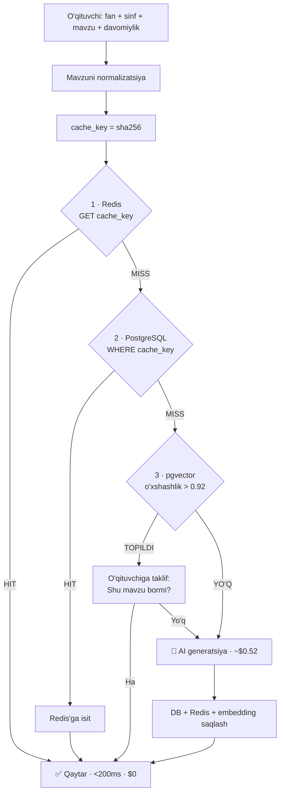
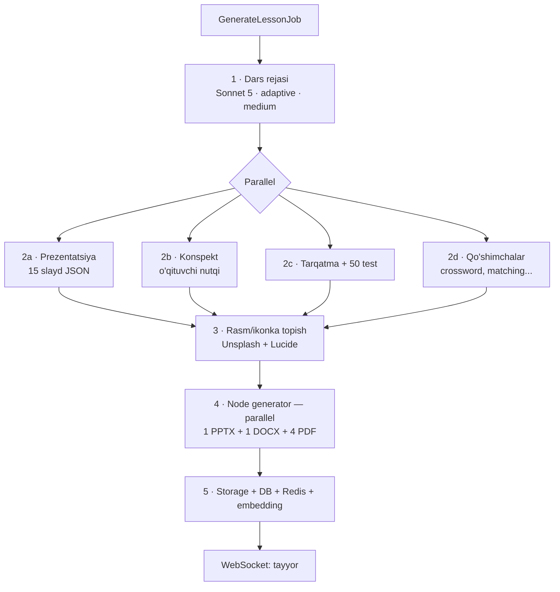

# USTOZ AI — AI, kesh, generatsiya va tahrirlash

> [← 01-ARXITEKTURA.md](01-ARXITEKTURA.md) · [← 02-BAZA-VA-API.md](02-BAZA-VA-API.md)

---

## 1. Kesh algoritmi — 3 bosqichli qidiruv

Bu tizimning iqtisodiy yuragi. Har bir so'rov AI'ga bormasdan oldin uch bosqichdan o'tadi.



### 1.1 Mavzu normalizatsiyasi

Bu bosqich kesh hit rate'ni ikki barobar oshiradi. Oddiy `strtolower()` **yetarli emas**.

```php
// app/Services/Cache/TopicNormalizer.php

class TopicNormalizer
{
    private const PREFIXES = [
        'mavzu:', 'тема:', 'урок:', 'topic:', 'дарс:', 'dars:',
    ];

    public function normalize(string $topic, string $language): string
    {
        $t = trim(mb_strtolower($topic, 'UTF-8'));

        // 1. Prefikslarni olib tashlash
        foreach (self::PREFIXES as $p) {
            if (str_starts_with($t, $p)) {
                $t = trim(mb_substr($t, mb_strlen($p)));
            }
        }

        // 2. Sinf raqamini olib tashlash: "7-sinf uchun", "7 класс"
        $t = preg_replace('/\b\d{1,2}[\-\s]?(sinf|синф|класс|grade)\b/u', '', $t);

        // 3. Tinish belgilari va ortiqcha bo'shliqlar
        $t = preg_replace('/[^\p{L}\p{N}\s]/u', ' ', $t);
        $t = preg_replace('/\s+/u', ' ', $t);

        // 4. O'zbek tili: kirill ↔ lotin yagona shaklga
        if (in_array($language, ['uz', 'uz_cyrl'])) {
            $t = $this->toLatin($t);   // "Ўзбек тили" → "ozbek tili"
        }

        return trim($t);
    }
}
```

**Natija:**

| O'qituvchi yozgani | Normalizatsiyadan keyin |
|---|---|
| `Имя прилагательное` | `имя прилагательное` |
| `Тема: Имя прилагательное (7 класс)` | `имя прилагательное` |
| `имя  прилагательное!!!` | `имя прилагательное` |
| `Ўзбек тилида сифат` | `ozbek tilida sifat` |
| `O'zbek tilida sifat` | `ozbek tilida sifat` |

Bu to'rt xil yozuv — **bitta keshga** tushadi.

### 1.2 Kesh kaliti

```php
$cacheKey = hash('sha256', implode('|', [
    $subjectId,
    $grade,
    $topicNormalized,
    $duration,      // 45 | 80
    $language,      // uz | uz_cyrl | ru | en
    $variant,       // 1 | 2 | 3
]));
```

### 1.3 O'xshashlik qidiruvi (pgvector)

Aniq mos kelmasa — ma'noviy yaqin mavzu qidiriladi:

```sql
SELECT id, topic_display, hit_count,
       (rating_sum::float / NULLIF(rating_count,0)) AS rating,
       1 - (topic_embedding <=> :embedding) AS similarity
FROM material_sets
WHERE subject_id = :subject_id
  AND grade      = :grade
  AND duration   = :duration
  AND language   = :language
  AND status     = 'ready'
ORDER BY topic_embedding <=> :embedding
LIMIT 3;
```

**Muhim qoida:** `similarity > 0.92` bo'lsa ham **avtomatik ishlatilmaydi**.
O'qituvchiga ko'rsatiladi: *"«Имя прилагательное» mavzusi bor (137 o'qituvchi ishlatgan, ★4.6). Shuni ochamizmi yoki yangi yaratamizmi?"*

Sabab: avtomatik almashtirish o'qituvchining ishonchini yo'qotadi. Tanlov uniki bo'lishi kerak.

### 1.4 Variantlar — bir maktabdagi ikki o'qituvchi muammosi

**Muammo:** Bitta maktabda ikki rus tili o'qituvchisi bir xil mavzuni so'rasa — bir xil slaydlarni oladi. Bu noqulay.

**Yechim:**

```php
// Mashhur mavzularga fon rejimida 2-3 variant yaratiladi
if ($set->hit_count > 20 && $set->variant === 1) {
    GenerateVariantJob::dispatch($set, variant: 2);
}

// O'qituvchiga variant user_id asosida barqaror tanlanadi
// (bir o'qituvchi doim bir xil variantni ko'radi — chalkashmasin)
$variant = ($userId % $availableVariants) + 1;
```

Bundan tashqari interfeysda **"Boshqa variant"** tugmasi bo'ladi — bosilganda keyingi variant ko'rsatiladi.

---

## 2. AI arxitekturasi

### 2.1 Model tanlovi

| Bosqich | Model | Sabab |
|---|---|---|
| Dars rejasi | `claude-sonnet-5` | Sifat langari — butun material shu rejaga tayanadi |
| Prezentatsiya | `claude-sonnet-5` | Pedagogik mazmun + tuzilma |
| Konspekt | `claude-sonnet-5` | O'qituvchi nutqi, uzun matn |
| Testlar | `claude-haiku-4-5` | Tuzilmali, oddiy — 3× arzon |
| Qo'shimchalar | `claude-haiku-4-5` | Crossword, matching — mexanik |

> **Boshlanishida hammasini `claude-sonnet-5` bilan qiling.** Sifat isbotlangach, testlar va qo'shimchalarni Haiku'ga o'tkazing — generatsiya narxi ~25% pasayadi.

**Joriy narxlar (1M token uchun):**

| Model | Kirish | Chiqish |
|---|---|---|
| `claude-opus-5` | $5.00 | $25.00 |
| `claude-sonnet-5` | $3.00 | $15.00 |
| `claude-haiku-4-5` | $1.00 | $5.00 |

> 💡 Sonnet 5 uchun **2026-08-31 gacha** kirish tanishtiruv narxi $2.00 / chiqish $10.00.

### 2.2 Provayder abstraksiyasi

```php
// app/Services/Ai/Contracts/AiProvider.php

interface AiProvider
{
    /**
     * JSON sxemasiga qat'iy mos javob qaytaradi.
     */
    public function generateStructured(
        string $prompt,
        array  $schema,
        array  $options = []   // model, effort, thinking, max_tokens
    ): AiResult;

    public function name(): string;
    public function estimateCost(int $inputTokens, int $outputTokens): float;
}
```

**PHP SDK:** `composer require anthropic-ai/sdk`

> ⚠️ PHP SDK'da yuqori darajadagi argumentlar **camelCase** (`maxTokens`, `outputConfig`), ichki massiv kalitlari esa hujjatdagidek yoziladi.

### 2.3 Tuzilmali chiqish (Structured Outputs) — majburiy

AI'dan matn emas, **qat'iy JSON** olamiz. Bu ikki muammoni yechadi: parsing xatolari va prompt injection.

```php
$result = $client->messages()->create(
    model: 'claude-sonnet-5',
    maxTokens: 16000,
    thinking: ['type' => 'disabled'],           // tuzilmali generatsiyada keraksiz
    outputConfig: [
        'effort' => 'medium',
        'format' => [
            'type'   => 'json_schema',
            'schema' => PresentationSchema::get(),
        ],
    ],
    system: $this->systemPrompt($subject, $grade, $language),
    messages: [['role' => 'user', 'content' => $userPrompt]],
);
```

**Nima uchun `thinking: disabled`:**
Claude Sonnet 5'da adaptiv fikrlash **sukut bo'yicha yoqilgan**. Prezentatsiya JSON'ini yaratishda u qo'shimcha qiymat bermaydi, lekin tokenlarni yeydi. Dars **rejasi** bosqichida esa yoqib qo'ying — u yerda haqiqiy pedagogik qaror qabul qilinadi:

```php
// 1-bosqich — reja: fikrlash YOQILGAN
thinking: ['type' => 'adaptive'],
outputConfig: ['effort' => 'medium'],

// 2-bosqich — kontent: fikrlash O'CHIRILGAN
thinking: ['type' => 'disabled'],
outputConfig: ['effort' => 'low'],
```

> ⚠️ `thinking: disabled` bilan `effort` faqat `high` yoki undan past bo'lishi mumkin (Opus 5 uchun). Sonnet 5'da bu cheklov yo'q, lekin baribir `low`/`medium` ishlating.

---

## 3. Generatsiya oqimi



### 3.1 Bosqichlar va tokenlar

| Bosqich | Kirish | Chiqish | Model | Narx |
|---|---:|---:|---|---:|
| 1. Dars rejasi | 1 500 | 2 000 | Sonnet 5 | $0.035 |
| 2a. Prezentatsiya | 2 000 | 8 000 | Sonnet 5 | $0.126 |
| 2b. Konspekt | 2 000 | 7 000 | Sonnet 5 | $0.111 |
| 2c. Tarqatma + testlar | 2 000 | 12 000 | Sonnet 5 | $0.186 |
| 2d. Qo'shimchalar | 1 500 | 4 000 | Sonnet 5 | $0.065 |
| **JAMI** | **9 000** | **33 000** | | **≈ $0.52** |

Testlar va qo'shimchalarni Haiku 4.5'ga o'tkazsangiz: **≈ $0.40** (−23%).

### 3.2 Prompt tuzilishi

Har bosqich uchun bir xil qolip:

```
SYSTEM (keshlanadi — o'zgarmaydi):
  ├── Rol: "Sen 20 yillik tajribaga ega {fan} o'qituvchisisan"
  ├── Metodika: O'zbekiston DTS talablari, interaktiv usullar
  ├── Til qoidalari: {language} da yoz
  ├── Yosh xususiyati: {grade}-sinf o'quvchisi darajasi
  └── Chiqish qoidalari: JSON sxemasiga qat'iy mos

USER (o'zgaruvchan):
  ├── <lesson_plan>{1-bosqich natijasi}</lesson_plan>
  ├── <user_topic>{normalizatsiyalangan mavzu}</user_topic>
  └── Vazifa: {aniq topshiriq}
```

**Prompt injection himoyasi:** o'qituvchi kiritgan mavzu `<user_topic>` teglari ichida, va JSON sxemasi bilan validatsiya qilinadi. Sxemaga mos kelmagan javob rad etiladi va qayta so'raladi (2 marta).

### 3.3 Prompt keshlash

System prompt har fan uchun bir xil (~2 000 token). `cache_control` bilan keshlansa, kirish narxi 0.1× ga tushadi.

```php
system: [[
    'type' => 'text',
    'text' => $this->systemPrompt($subject, $grade, $language),
    'cache_control' => ['type' => 'ephemeral'],
]],
```

> **Halol baho:** bu yerda tejash **kichik** — generatsiya narxining 95% chiqish tokenlaridan keladi, kirish esa atigi 5%. Prompt keshlash ~$0.02 tejaydi. **Haqiqiy tejash — material keshi** (bazadagi), prompt keshi emas. Ammo bepul, shuning uchun yoqib qo'ying.
>
> Diqqat: Sonnet 5 uchun minimal keshlanadigan prefiks — **1024 token**. Undan qisqa system prompt umuman keshlanmaydi (xato bermaydi, shunchaki ishlamaydi).

---

## 4. Fayl generatsiyasi (Node xizmati)

### 4.1 Nima uchun alohida xizmat

PHP'ning `phpoffice/phppresentation` kutubxonasi PPTX yaratadi, lekin dizayn imkoniyatlari cheklangan. `pptxgenjs` esa maketlar, gradientlar, ikonkalar, diagrammalar bilan to'liq ishlaydi.

```
Laravel Job ──POST /render/pptx──> Node (localhost:4000) ──> fayl yo'li
```

### 4.2 Render maqsadlari — 6 ta fayl

| Endpoint | Fayl | Kutubxona | Izoh |
|---|---|---|---|
| `POST /render/pptx` | Prezentatsiya | `pptxgenjs` | 15 slayd, 12 maket, fan mavzusi |
| `POST /render/docx` | Konspekt | `docx` (npm) | Sarlavhalar, jadvallar, kolontitul |
| `POST /render/pdf/handout` | Tarqatma | Puppeteer | Kartochka, mashq, kesib olinadigan qismlar |
| `POST /render/pdf/test-simple` | Oddiy test (20) | Puppeteer | Savollar + **alohida javoblar varag'i** |
| `POST /render/pdf/test-quarter` | Chorak testi (30) | Puppeteer | 3 daraja + **alohida javoblar varag'i** |
| `POST /render/pdf/extras` | Qo'shimchalar | Puppeteer | Crossword, matching, warm-up, exit ticket |

**Nima uchun PDF (DOCX emas):**
Testlar va tarqatma materiallar to'g'ridan-to'g'ri **chop etish** uchun. PDF har printerda bir xil chiqadi, DOCX esa Word versiyasiga qarab siljiydi. Kesib olinadigan kartochkalar va crossword panjarasi uchun bu hal qiluvchi.

**PDF tuzilishi (test uchun):**

```
1-sahifa:  Sarlavha + o'quvchi ismi/sinf maydonlari
2..n:      Savollar (A/B/C/D)
─── SAHIFA UZILISHI ───
Oxirgi:    🔑 JAVOBLAR VARAG'I (faqat o'qituvchi uchun)
           1-B  2-A  3-D ...  + qisqa izohlar
```

Javoblar **alohida sahifada** — o'qituvchi shu sahifani olib qolib, qolganini tarqatadi.

**Puppeteer HTML shablonlari:**

```
generator/src/pdf/templates/
├── handout.hbs          # tarqatma
├── test.hbs             # test (simple va quarter uchun bir xil)
├── answer-key.hbs       # javoblar varag'i
├── crossword.hbs        # SVG panjara
├── word-search.hbs
├── matching.hbs
└── _base.hbs            # A4, chekkalar, kolontitul, shrift
```

> Puppeteer chiroyli PDF beradi, lekin **Chromium kerak**. Docker'da `--no-sandbox` bilan ishlaydi. Bitta PDF ~1.5 soniya — 4 ta PDF ketma-ket emas, **parallel** qurilsin.

### 4.3 Slayd maketlari (12 ta)

AI har slayd uchun `layout` tanlaydi, Node esa uni chizadi:

| Maket | Ishlatilishi |
|---|---|
| `title` | Sarlavha slaydi |
| `objectives` | Dars maqsadlari |
| `bullets` | Oddiy ro'yxat |
| `two_col` | Ikki ustun taqqoslash |
| `image_right` | Matn + rasm |
| `image_full` | To'liq ekran rasm |
| `table` | Jadval |
| `chart` | Diagramma (bar/pie/line) |
| `quote` | Iqtibos / qoida |
| `quiz` | Savol slaydi |
| `activity` | Mashq / topshiriq |
| `summary` | Xulosa + uy vazifasi |

### 4.4 Fan mavzulari (theme)

Har fan uchun rang va shrift to'plami:

```js
// generator/src/pptx/themes/index.js
export const themes = {
  language_arts: { primary: '#4F46E5', accent: '#F59E0B', font: 'Manrope' },
  mathematics:   { primary: '#0891B2', accent: '#F97316', font: 'Inter'   },
  natural_sci:   { primary: '#059669', accent: '#EAB308', font: 'Inter'   },
  humanities:    { primary: '#B45309', accent: '#0EA5E9', font: 'Manrope' },
  it:            { primary: '#7C3AED', accent: '#10B981', font: 'Inter'   },
};
```

### 4.5 Rasmlar

| Manba | Ishlatilishi | Narx |
|---|---|---|
| **Lucide SVG** (lokal) | Ikonkalar — har slaydda | Bepul |
| **Unsplash API** | Fon va mavzuviy rasmlar | Bepul (50/soat) |
| **Ichki kutubxona** | Fanga xos diagrammalar | Qo'lda to'ldiriladi |
| ❌ AI rasm generatsiyasi | — | Qimmat, sekin, o'quv diagrammalarida sifatsiz |

AI har slayd uchun `image_query` beradi (`"russian grammar classroom"`), Node esa Unsplash'dan qidirib, keshga saqlaydi.

---

## 5. Tahrirlash (Editor)

### 5.1 Asosiy qoida — kesh buzilmaydi

O'qituvchi tahriri `material_sets.content`ga **hech qachon yozilmaydi**.

```
material_sets.content   (kesh, o'zgarmas, 500 o'qituvchiga umumiy)
        +
lesson_edits.overrides  (shu o'qituvchiga xos, faqat o'zgargan qismlar)
        ↓
   deepMerge() → ko'rsatish / fayl qurish
```

Aks holda: bir o'qituvchi slaydni o'chirsa — keshni ishlatayotgan minglab boshqasida ham o'chib ketadi.

### 5.2 MVP editori — matn darajasida

**To'liq WYSIWYG slayd muharriri qurmang.** Bu 3+ oy. MVP uchun:

| Imkoniyat | Murakkablik | MVP'da |
|---|---|---|
| Slayd sarlavhasi/matnini o'zgartirish | Oson | ✅ |
| Slaydni o'chirish | Oson | ✅ |
| Slaydlar tartibini o'zgartirish | Oson | ✅ |
| Testni tahrirlash / o'chirish | Oson | ✅ |
| Konspekt bo'limlarini tahrirlash | Oson | ✅ |
| "Bu qismni qayta yarat" (AI) | O'rta | ✅ |
| O'z rasmini yuklash | O'rta | ✅ |
| Yangi slayd qo'shish (maket tanlab) | O'rta | ⏳ 2-faza |
| Sudrab tashlash (drag-drop) dizayn | Qiyin | ❌ |
| PDF ichida chizish | Juda qiyin | ❌ |

Qolganini o'qituvchi **PowerPoint'da** qiladi — u allaqachon biladi va yaxshi ishlaydi.

### 5.3 "Qayta yarat" — eng qimmatli tugma

Butun to'plamni emas, faqat bitta qismni qayta yaratish:

```
POST /lessons/{id}/regenerate  { "section": "presentation.slides.7" }
```

Narxi: ~$0.02 (butun to'plam $0.52 o'rniga). Bu o'qituvchiga "AI'ni boshqarish" hissini beradi — mahsulotning eng kuchli tuyg'usi.

### 5.4 Qayta qurish

Tahrirdan keyin fayllar qayta quriladi va `lessons.rebuilt_files` sifatida saqlanadi — **kesh fayllari tegilmaydi**.

---

## 6. Xarajat hisobi

### 6.1 Bir generatsiya narxi

| Ssenariy | Narx |
|---|---:|
| To'liq Sonnet 5 | $0.52 |
| Sonnet 5 + Haiku 4.5 (test/qo'shimcha) | $0.40 |
| Batch API orqali (50% chegirma) | **$0.20** |
| **Keshdan** | **$0.00** |

### 6.2 Bir o'qituvchi oylik xarajati

Oyiga 30 ta dars yaratadi degan taxminda:

| Kesh hit rate | AI so'rovlari | Oylik xarajat |
|---|---:|---:|
| 0% (birinchi kun) | 30 | $15.60 |
| 30% (1-oy) | 21 | $10.92 |
| 50% (3-oy) | 15 | $7.80 |
| 70% (6-oy) | 9 | $4.68 |
| **90% (kesh to'lgach)** | 3 | **$1.56** |

### 6.3 🔑 Eng muhim strategik tavsiya: keshni oldindan to'ldirish

**Muammo:** birinchi oylarda kesh bo'sh — har o'qituvchi zarar keltiradi.

**Yechim:** O'zbekiston davlat ta'lim standarti — **belgilangan mavzular ro'yxati**. Ular oldindan ma'lum. Ishga tushirishdan oldin **Batch API** (50% arzon) bilan tunda generatsiya qiling.

| Qamrov | Mavzular | Narx (batch) |
|---|---:|---:|
| Bitta fan, 5 sinf (rus tili 5–9) | 175 | **$35** |
| Bitta fan, 11 sinf | 385 | $77 |
| 5 asosiy fan × 11 sinf | 1 925 | $385 |
| **Barcha fanlar (~15 × 11 sinf)** | **~3 500** | **≈ $700** |

> **$700 bir marta to'lab, kesh hit rate'ni birinchi kundan ~85% qilish mumkin.**
> Bu butun loyihadagi eng yuqori ROI'li $700.

Amalga oshirish:

```bash
php artisan cache:warmup --subject=rus_tili --grades=5-9 --batch
```

`GenerateLessonJob` o'rniga **Message Batches API** ishlatiladi:
- 50% arzon
- 100 000 tagacha so'rov bitta to'plamda
- Ko'pchiligi 1 soat ichida tugaydi (kafolat 24 soat)
- Natijalar 29 kun saqlanadi

### 6.4 Obuna narxi — tavsiya

| Tarif | Muddat | Limit | Taklif narx |
|---|---|---|---|
| Sinov | 7 kun | 3 dars | 0 |
| Asosiy | 30 kun | 30 dars | **59 000 so'm** |
| Pro | 30 kun | 100 dars* | **99 000 so'm** |
| Yillik Pro | 365 kun | 100/oy | **890 000 so'm** |

\* "Cheksiz" o'rniga adolatli foydalanish limiti — himoya klapan.

**Nima uchun 49 000 emas, 59 000:**
Kesh to'lguncha (birinchi 3–6 oy) bir faol o'qituvchi $8–11 xarajat qiladi. 49 000 so'm ≈ $4 — bu zarar. 59 000 so'm ≈ $4.7 — bu ham tor, shuning uchun **30 ta dars limiti** muhim. Kesh 70%+ ga chiqqach, marja keskin ochiladi.

> ⚠️ Yuqoridagi dollar hisoblari joriy kursga bog'liq. Ishga tushirishdan oldin qayta hisoblang.

### 6.5 Xarajatni nazorat qilish

| Chora | Ta'sir |
|---|---|
| Batch bilan oldindan keshlash | Eng katta — hit rate'ni 85%+ ga chiqaradi |
| Testlar/qo'shimchalarni Haiku'ga | −23% generatsiya narxi |
| `effort: low/medium` + `thinking: disabled` | −15…25% chiqish tokenlari |
| Tarif limitlari (30/100 dars) | Zarar keltiruvchi foydalanuvchini to'xtatadi |
| `preflight` bepul (kvota sarflamaydi) | O'qituvchi keshni qidirishdan qo'rqmaydi |
| `popular-topics` taklifi | O'qituvchini kesh bor mavzularga yo'naltiradi |
| Kunlik AI xarajat limiti (admin) | Favqulodda tormoz |

**Admin panelda kuzatiladi:**
- Kunlik/oylik AI xarajati (`ai_usage_logs`)
- Kesh hit rate (kunlik grafik)
- Eng qimmat foydalanuvchilar
- O'rtacha generatsiya narxi

---

## 7. Sifat nazorati

### 7.1 O'qituvchi bahosi

Har material to'plamidan keyin: **★1–5 + ixtiyoriy izoh**.

```
rating < 3.0  AND  rating_count >= 5
      → admin panelda "Ko'rib chiqish kerak" belgisi
      → o'chirilsa, keyingi so'rovda qayta yaratiladi
```

### 7.2 Avtomatik tekshiruv (generatsiyadan keyin)

| Tekshiruv | Amal |
|---|---|
| JSON sxemasiga mos emas | Qayta so'rash (max 2 marta) |
| Slaydlar soni ≠ 15 | Qayta so'rash |
| Test javoblari A/B/C/D emas | Qayta so'rash |
| Bo'sh maydonlar (title, bullets) | Qayta so'rash |
| Til mos emas (`ru` so'raldi, `uz` keldi) | Qayta so'rash |
| 3 marta muvaffaqiyatsiz | `status = failed`, kvota qaytariladi |

### 7.3 Xato holatida

```php
try {
    $result = $orchestrator->generate($lesson);
} catch (GenerationFailedException $e) {
    $lesson->update(['status' => 'failed']);
    $subscription->decrement('generations_used');   // kvota qaytadi
    Log::error('Generation failed', [...]);
    // O'qituvchiga: "Xatolik yuz berdi, kvotangiz qaytarildi. Qayta urinib ko'ring."
}
```

O'qituvchi hech qachon xato uchun to'lamaydi.
